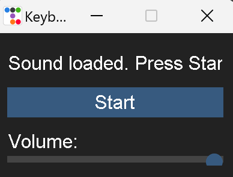

---
A desktop app that plays custom sound effects whenever you press or release a keyboard key. Built with Python, `pydub`, `pygame`, `pynput`, and `ttkbootstrap` for a stylish GUI.

# 🎹 Keyboard Sound App



---

## 📦 Features

- ⌨️ Real-time keyboard key press & release detection
- 🔊 Customizable sound effects sliced from a single audio file
- 🎚️ Volume control via GUI slider
- 🌙 Dark-themed GUI using `ttkbootstrap`
- 🔁 Threaded sound processing for smooth playback
- 💾 Configurable key mappings and sound definitions from a JSON file
- 🧪 Logging to `keyboard.log` for debugging

---

## 🧰 Requirements

- Python 3.8+
- `pygame`
- `pydub`
- `pynput`
- `ttkbootstrap`
- `ffmpeg` (required by `pydub`)

Install Python dependencies:

```bash
pip install pygame pydub pynput ttkbootstrap
```

Make sure `ffmpeg` is installed and accessible from the system PATH.

---

## 🗂️ Project Structure

```
keyboard_sound_app/
├── main.py
├── sound_config.json
├── keyboard.log
└── sound_file.ogg / mp3 / wav (your input sound file)
```

---

## 🧾 Configuration File

`sound_config.json` defines how to slice your input sound and map it to keys.

### Example:

```json
{
  "sound": "sound_file.ogg",
  "defines": {
    "1": [0, 300],
    "1-up": [300, 150],
    "2": [450, 300],
    "2-up": [750, 150]
    // Add up to 10 and corresponding "-up" entries
  }
}
```

- Each number key corresponds to a slice from your sound file.
- `start_time` and `duration` are in milliseconds.
- `-up` is the sound played on key release.

---

## ▶️ How to Use

1. Place your `sound_config.json` and audio file in the same directory.
2. Run the app:

```bash
python main.py
```

3. Use the GUI to:
   - Start/stop listening to keyboard events
   - Adjust volume
   - View press/release status updates

---

## 📝 Notes

- Works on most platforms where `pynput` and `pygame` are supported.
- Make sure your sound file is properly sliced and formatted (`.ogg`, `.wav`, `.mp3` supported by `pydub`).
- Add more key mappings to `defines` in the JSON as needed.

---

